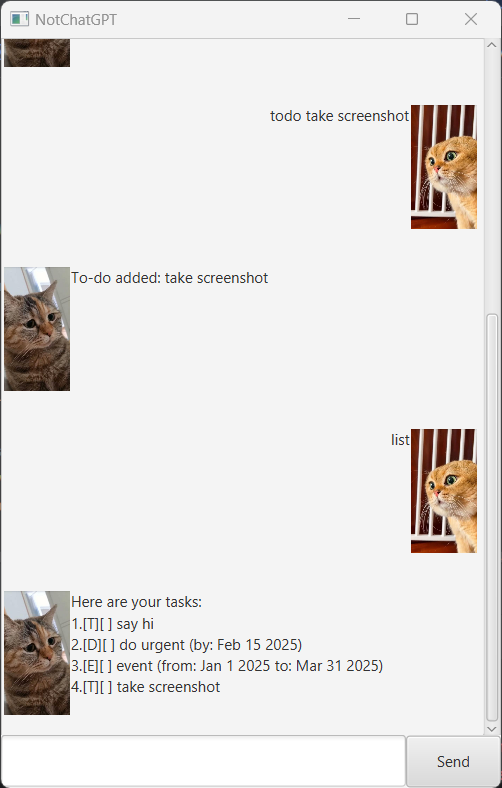

# NotChatGPT User Guide



Stay organized effortlessly with NotChatGPT, your personal to-do list chatbot! Designed to help you manage your tasks seamlessly, this chatbot allows you to add, track, update, and complete tasks with simple commands—just like chatting with a friend.

- [Adding deadlines](#adding-deadlines).

## Quick start

## Features

### Help : `help`
Shows a message with all available commands.
Command usage: `help`

### Exit the Chatbot : `bye`
Closes the chatbot and displays a farewell message.
Command usage: `bye`

### View All Tasks : `list`
Displays a list of all tasks, including their type, status (completed or not), and details.
Command usage: `list`

### Delete a Task : `delete`
Removes a specific task from the list based on its ID.
Command usage: `delete <id>`
Example usage: `delete 1`

### Mark a Task as Complete : `mark`
Marks a task as done, updating its status.
Command usage: `mark <id>`
Example usage: `mark 2`

### Unmark a Completed Task : `unmark`
Reverts a completed task back to incomplete.
Command usage: `unmark <id>`
Example usage: `unmark 3`

### Add a To-Do Task : `todo`
Creates a new To-Do task with the given description.
Command usage: `todo <desc>`
Example usage: `todo Buy groceries`

### Add a Deadline : `deadline`
Creates a new Deadline task with a specified due date.
Command usage: `deadline <desc> /by <yyyy-mm-dd>`
Example usage: `deadline Submit report /by 2025-02-25`

### Add an Event : `event`
Creates an Event task with a start and end date.
Command usage: `event <desc> /from <yyyy-mm-dd> /to <yyyy-mm-dd>`
Example usage: `event Conference /from 2025-03-01 /to 2025-03-03`

### Find a Task : `find`
Searches for tasks that contain the given phrase in their description.
Command usage: `find <target phrase>`
Example usage: `find report`

### Update a Task : `update`
Modifies a specific attribute of an existing task.
Command usage: `update <id> /<parameter> <content>`
Example usage: `update 2 /desc Submit final report`

## sfgsdgsd

// Describe the action and its outcome.

// Give examples of usage

Example: `keyword (optional arguments)`

// A description of the expected outcome goes here

```
expected output
```

## Feature ABC

// Feature details


## Feature XYZ

// Feature details